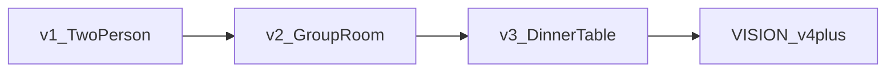

# Voice Bridge

Real-time voice translation between two devices. Hold a button, speak in your language, and your partner hears the translation in theirs.

**v1.1:** English, Hebrew, and Russian. Push-to-talk, first-come-first-serve turns, phone + browser.

## What it does

- Two people join the same room with a short code
- Each person sets **My language** (English, Hebrew, or Russian)
- **First come, first serve:** whoever holds **Hold to talk** first speaks
- Speech is transcribed, translated, and played to the other person
- Transcripts appear on screen with latency timing

## How to use it

### 1. Set languages (before joining)

On each device: **Language settings** → pick the language **you** speak.

Example: Hebrew speaker sets Hebrew, English speaker sets English, Russian speaker sets Russian.

> Language is sent when you join a room. If you change it later, leave and rejoin.

### 2. Start a session

| Device | Action |
|---|---|
| **Phone** | Create a new room (note the code) |
| **Browser or second phone** | Enter the code → Join room |

Both should show **2 participants**.

### 3. Talk

1. When both see **Ready: hold to talk**, either person can press first
2. Hold the button, speak, then release
3. Wait a few seconds for translation
4. The other person hears the translated audio automatically
5. Floor opens again; next person to press speaks

### Testing with phone + Mac browser

```bash
# Terminal 1: phone (Expo Go)
cd apps/mobile
cp .env.example .env   # first time only; set your server URL in .env
npx expo start

# Terminal 2: browser
cd apps/mobile
npx expo start --web
```

Open `http://localhost:8081` in Chrome. Allow microphone when prompted.

## Architecture

```
Phone/Browser                    Railway Server                    OpenAI
     │                                │                              │
     │  WebSocket (Socket.io)         │                              │
     ├───────────────────────────────►│  Whisper STT                 │
     │  audio_chunk / claim_turn      ├─────────────────────────────►│
     │                                │  GPT-4o-mini translate       │
     │◄───────────────────────────────┤  TTS                         │
     │  translation_result + audio    │                              │
```

## Project structure

```
voice-bridge/
├── server/           # Node.js + Socket.io backend
├── apps/mobile/      # Expo app (iOS, Android, web)
├── package.json      # Railway deploy entry
└── railway.toml      # Railway build config
```

## Server setup

### Prerequisites

- Node.js 20+
- OpenAI API key with credits

### Local development

```bash
cd server
npm install
cp .env.example .env   # add OPENAI_API_KEY
npm run dev
curl http://localhost:3001/health
```

### Deploy to Railway

1. Push this repo to GitHub
2. Railway → **Deploy from GitHub** → select the repo
3. Root directory: **repository root** (uses `railway.toml`)
4. Variables:
   - `OPENAI_API_KEY`: your key (no trailing spaces)
   - `CLIENT_ORIGIN`: `*` for dev, restrict in production
5. Verify: `https://<your-app>.up.railway.app/health`

### Point the app at your server

```bash
cd apps/mobile
cp .env.example .env
```

Edit `.env` (never commit this file):

```bash
EXPO_PUBLIC_SERVER_URL=https://your-app.up.railway.app
```

Restart Expo after changing (`npx expo start --clear`).

## WebSocket events

| Event | Direction | Purpose |
|---|---|---|
| `join_room` | client → server | Join with room code and language |
| `claim_turn` | client → server | Claim speaking turn (first press wins) |
| `audio_chunk` | client → server | Send recorded audio |
| `turn_state` | server → clients | Whose turn / processing state |
| `translation_result` | server → listener | Translated audio + transcript |
| `translation_sent` | server → speaker | Confirmation + transcript |
| `usage_update` | server → clients | Session + room active + per-user active time |
| `error` | server → client | Error message |

**Usage metrics:** Session duration is wall-clock from when two participants join. **Active conversation time** (room) is the merged union of speech+processing intervals across all participants, so overlapping speech in v2+ does not double-count. **My active conversation time** is the sum of your own turns (speech hold + translation latency).

`audio_chunk` may include `recordingStartedAt` (epoch ms) so the server can anchor each interval at hold-to-talk start.

## API

`POST /api/translate?sourceLang=en&targetLang=he&format=wav`: send raw audio, get JSON with `sourceText`, `translatedText`, `audioBase64`, `latencyMs`.

`GET /health`: server status.

## Security

- API keys live only in `server/.env` (local) or Railway Variables (production)
- Never commit `.env` files
- Before pushing: `git grep -iE "sk-|api_key" -- ':!*.example'`

### Going public on GitHub

Treat your **server URL** like an API key: keep it in `apps/mobile/.env` (gitignored), not in source code. The repo ships `.env.example` with a placeholder.

The mobile app connects to your Railway deployment. If someone learns that URL, they could use your server and spend OpenAI credits. Rate limits (below) reduce that risk.

**Built-in rate limits** (per IP / per connection):

| Variable | Default | Protects |
|---|---|---|
| `RATE_LIMIT_TRANSLATE_PER_HOUR` | 30 | REST `/api/translate` |
| `RATE_LIMIT_AUDIO_PER_HOUR` | 120 | WebSocket translations |
| `RATE_LIMIT_JOIN_PER_MINUTE` | 20 | Room join attempts |

Set these in Railway Variables. For personal use, defaults are plenty. Tighten if needed.

**Optional later:** user auth, per-room tokens, or requiring everyone to self-host their own Railway backend.

## Known limitations (v1.1)

- Two participants per room only
- English, Hebrew, and Russian only
- One speaker at a time; floor is open until someone presses (not pre-assigned)
- ~3–6 second latency per message
- Web push-to-talk requires Chrome; mic active only while holding button
- Language setting applies on room join; rejoin after changes

## Roadmap

### Shipped and next (v1.x)

| Version | Features |
|---|---|
| **v1.0** (done) | EN ↔ HE, 2 participants, push-to-talk, first-come-first-serve turns, phone + web |
| **v1.1** (done) | + Russian (EN ↔ HE ↔ RU) |
| v1.2 | Voice matching (speaker tone in 1:1) |
| v1.3 | Auto-detect spoken language; user sets preferred hearing language only |
| v1.4 | App Store / PWA, basic user profiles |

### Group and table (v2–v3)

| Version | Features |
|---|---|
| v2.0 | Optional hands-free (VAD); pass-through languages (transcribe, no TTS); saved language prefs |
| v2.1 | 3–6 participants; device = persona (no shared-mic diarization yet) |
| v2.5 | Per-persona mute/unmute; per-speaker transcripts |
| v3.0 | Dinner table mode: multi-lingual room, mute matrix, mixed pass-through |
| v3.1 | Minute-based pricing + usage dashboard |

### Product arc

v1 is a two-person walkie-talkie interpreter. v2 adds group rooms, filters, and hands-free options. v3 targets a dinner-table interpretation layer where each person hears what they need and can mute what they don't.



Long-term north star (wearables, multimodal intent): see [VISION.md](VISION.md).

Mission and long-term direction: [VISION.md](VISION.md).

## License

Personal project in real-time voice translation. All rights reserved.
